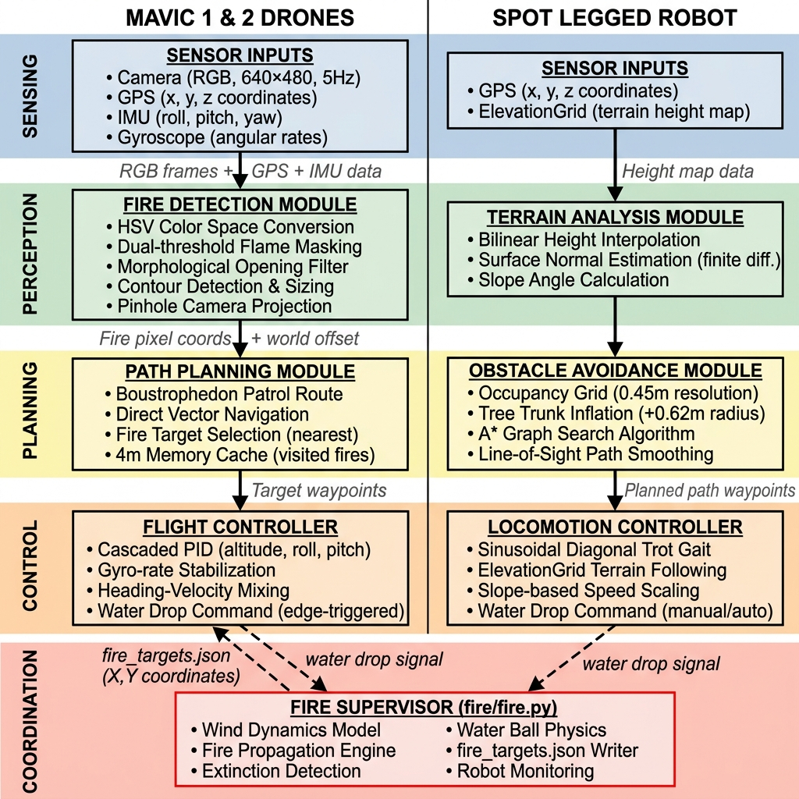
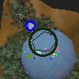

# 🔥 Autonomous Forest Firefighting Robot Swarm

> A heterogeneous multi-robot system that autonomously **detects, navigates toward, and extinguishes** wildfires in a simulated forest — built on the [Webots](https://cyberbotics.com) robotics simulator.

<p align="center">
  
</p>

<p align="center">
  <a href="Autonomous_Fire_Drones.mp4">▶️ Watch the demo video</a>
  &nbsp;•&nbsp;
  <a href="projects/forest_firefighters/Forest_Firefighting_Report.pdf">📄 Read the full report</a>
</p>

---

## 🌲 Overview

This project implements an autonomous, heterogeneous robot team that fights wildfires in a dynamic forest environment. A centralized **Fire Supervisor** simulates realistic fire propagation and wind, while a fleet of robots cooperates to put fires out:

- **2 × Mavic 2 Pro drones** patrol the canopy, detect smoke/flame with computer vision, and drop water.
- **1 × Spot legged robot** patrols the ground, navigating around trees to reach fires.

The robots coordinate through a shared target registry and the Webots API — no robot acts blindly. The result is a **100% fire-extinction success rate** with a primary fire-response time of **~66 seconds**.

> ⚠️ **Compatibility:** This simulation requires **Webots R2021b**.

---

## ✨ Key Features

| Capability | Description |
|---|---|
| 🔥 **Dynamic fire simulation** | Fire ignites randomly, spreads to nearby trees based on wind intensity, direction, and distance, and burns out naturally. |
| 🌬️ **Wind model** | Live-adjustable wind intensity and direction that influence fire spread; can evolve randomly. |
| 🛰️ **Autonomous aerial patrol** | Two drones patrol in opposite directions, fly directly to broadcast fire coordinates, and verify targets visually before acting. |
| 👁️ **Computer-vision detection** | OpenCV HSV color segmentation + morphological filtering to isolate flame/smoke from a downward camera. |
| 🐕 **Ground robot path planning** | Spot uses **A\*** search on an inflated occupancy grid to navigate around 27 tree obstacles. |
| 🤝 **Multi-robot coordination** | A shared `fire_targets.json` registry and the Webots `customData` field synchronize detection, navigation, and water drops. |

---

## 🏗️ System Architecture

The system is built around three controllers that communicate through shared state:

```
                  ┌──────────────────────────┐
                  │   Fire Supervisor        │
                  │   (fire.py)              │
                  │  • fire propagation      │
                  │  • wind dynamics         │
                  │  • water physics         │
                  └───────────┬──────────────┘
                writes (X,Y)  │   reads customData
              of burning trees│   (water-drop requests)
                              ▼
                   ┌──────────────────────┐
                   │  fire_targets.json   │  ◄── shared registry
                   └──────────┬───────────┘
                  reads       │       reads
        ┌─────────────────────┴────────────────────┐
        ▼                                           ▼
┌────────────────────┐                   ┌────────────────────┐
│ Mavic Drones ×2    │                   │ Spot Ground Robot  │
│ autonomous_mavic.py│                   │ spot.py            │
│ • patrol / fly to  │                   │ • A* path planning │
│   fire             │                   │ • patrol clearings │
│ • OpenCV verify    │                   │ • drop water       │
│ • drop water       │                   │                    │
└────────────────────┘                   └────────────────────┘
```

**How coordination works:**

1. **Altitude sync** — the supervisor delays ignition until a drone climbs above **40 m**, giving the fleet time to take off.
2. **Target broadcast** — the supervisor continuously serializes the `(X, Y)` coordinates of burning trees into `fire_targets.json`.
3. **Visual verification** — a drone flies to the broadcast coordinates, then uses its downward camera + OpenCV to lock onto the exact fire centroid before dropping water.
4. **Water drop via `customData`** — when aligned, a robot writes a water quantity to its `customData` field; the supervisor reads it on the next step and spawns water physics. Water landing within a fire's extinction radius puts it out.

> 📐 Detailed flow diagrams: [`system_coordination_flow.md`](projects/forest_firefighters/system_coordination_flow.md) and [`fire_supervisor_flow.md`](projects/forest_firefighters/fire_supervisor_flow.md).

---

## 🧠 Technical Highlights

- **Drone flight control** — altitude hold from GPS error, attitude stabilization from IMU + gyroscope feedback, and heading–velocity mixing that yaws the drone toward a target before accelerating to minimize overshoot.
- **Fire detection pipeline** — HSV color segmentation (double-threshold flame bounds + smoke mask), morphological opening to remove noise, contour detection with a minimum-radius threshold, and centroid-to-ground coordinate projection using camera FOV, altitude, and IMU angles.

  <p align="center"></p>

- **Spot path planning** — A\* on a 0.45 m-resolution occupancy grid; obstacles (27 Sassafras trunks parsed from the world) inflated by a 0.62 m safety radius, with a cost function that penalizes slope transitions.
- **Robustness fixes** — an 8 s post-drop cooldown prevents drones from re-targeting their own falling water; obstacle inflation resolved Spot's collisions; camera resolution capped at 100×100 with 32-step refresh to keep the simulation real-time.

---

## 🚀 Getting Started

### Prerequisites

1. Install **[Webots R2021b](https://cyberbotics.com)**.
2. Install **[Python 3.8](https://www.python.org/downloads/)**.
3. Install OpenCV for the vision pipeline:
   ```bash
   pip install opencv-python
   ```

### Run the simulation

```bash
git clone git@github.com:Robotics1025/forestrobot.git
cd forestrobot
```

Then open the world file in Webots:

```
projects/forest_firefighters/worlds/forest_firefighters.wbt
```

Press ▶ to start. The drones take off, the supervisor ignites the forest once a drone passes 40 m, and the team begins autonomous firefighting.

---

## 📁 Project Structure

```
projects/forest_firefighters/
├── worlds/
│   └── forest_firefighters.wbt        # Main simulation world
├── controllers/
│   ├── fire/fire.py                   # Fire Supervisor (propagation, wind, water physics)
│   ├── autonomous_mavic/              # Autonomous drone controller + OpenCV detection
│   ├── mavic/                         # Keyboard-driven Mavic demo controller
│   └── spot/spot.py                   # Spot ground robot (A* navigation)
├── protos/                            # Custom models: Fire, Smoke, Water, Sassafras, UnevenForest
├── plugins/robot_windows/fire/        # Wind control window (intensity & direction UI)
├── fire_targets.json                  # Shared fire-coordinate registry (runtime)
├── Forest_Firefighting_Report.pdf     # Full technical report
└── README.md                          # Project-level details
```

### Tunable fire parameters

Adjust these in [`controllers/fire/fire.py`](projects/forest_firefighters/controllers/fire/fire.py):

| Parameter | Effect |
|---|---|
| `Fire.MAX_PROPAGATION` | Max distance (m) fire can spread between trees |
| `Fire.MAX_EXTINCTION` | Max distance from which water extinguishes fire |
| `Fire.FIRE_DURATION` | Time for a fire to fully consume a tree |
| `Wind.INTENSITY_EVOLVE` / `Wind.ANGLE_EVOLVE` | Rate of wind change |
| `Wind.RANDOM_EVOLUTION` | Toggle random wind evolution |
| `Tree.ROBUSTNESS_VARIATION` | Variation in tree resistance to fire |

---

## 📊 Results

| Metric | Value |
|---|---|
| Fire extinction success rate | **100%** |
| Primary fire response time | **~66 s** |
| Camera processing resolution | 100 × 100 |
| Occupancy grid resolution | 0.45 m |

See the [full report](projects/forest_firefighters/Forest_Firefighting_Report.pdf) for the complete architecture, algorithms, verification tests, and analysis.

---

## 🛠️ Built With

- **[Webots R2021b](https://cyberbotics.com)** — robotics simulation
- **Python 3.8** — controller logic
- **OpenCV** — computer-vision fire detection
- **A\*** — Spot ground-robot path planning

---

## 📜 License & Attribution

This simulation extends the open-source **Forest Firefighters** example from the [Webots projects](https://github.com/cyberbotics/webots-projects) repository (Apache-2.0). The autonomous swarm controllers, coordination pipeline, computer-vision detection, and A\* navigation are original work by **Robotics1025**.
