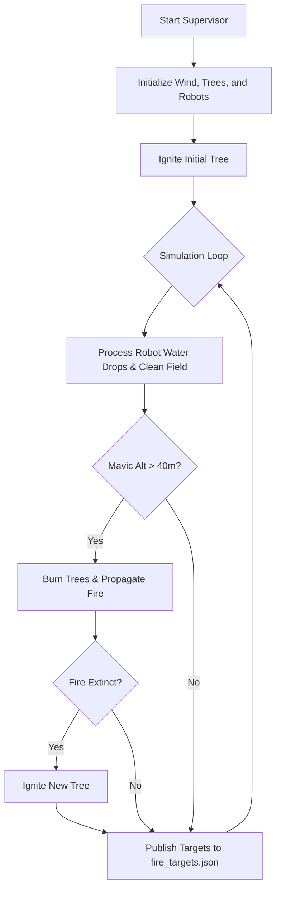

# Fire Supervisor Control Flow

This document outlines the control flow of the `fire.py` supervisor controller in the Forest Firefighters simulation. The supervisor is responsible for managing the physics of the simulation, including fire propagation, wind evolution, and robot interactions (such as water drops).

## Control Flow Diagram

## Logic Breakdown
1. **Initialization**: The script starts by initializing the wind conditions, parsing the Sassafras trees from the simulation environment, and registering the active robots.
2. **Initial Ignition**: A random tree is chosen and set on fire.
3. **Simulation Loop**: The controller enters a continuous loop for every step of the simulation.
    - **Water Processing**: The supervisor checks for water dropped by robots and cleans up any water that hits the ground.
    - **Altitude Check**: The main fire physics pause until the Mavic drones reach an altitude $> 40\text{m}$.
    - **Fire Propagation**: Trees continue to burn, and fire spreads to nearby trees depending on wind intensity, direction, and distance.
    - **Extinction Checks**: The supervisor evaluates if any water balls are close enough to extinguish a fire. If all fires are extinguished, a new tree is ignited to keep the simulation running.
    - **Target Broadcasting**: The exact $(X, Y)$ coordinates of all currently burning trees are continuously written to `fire_targets.json` so the robots can navigate to them.
